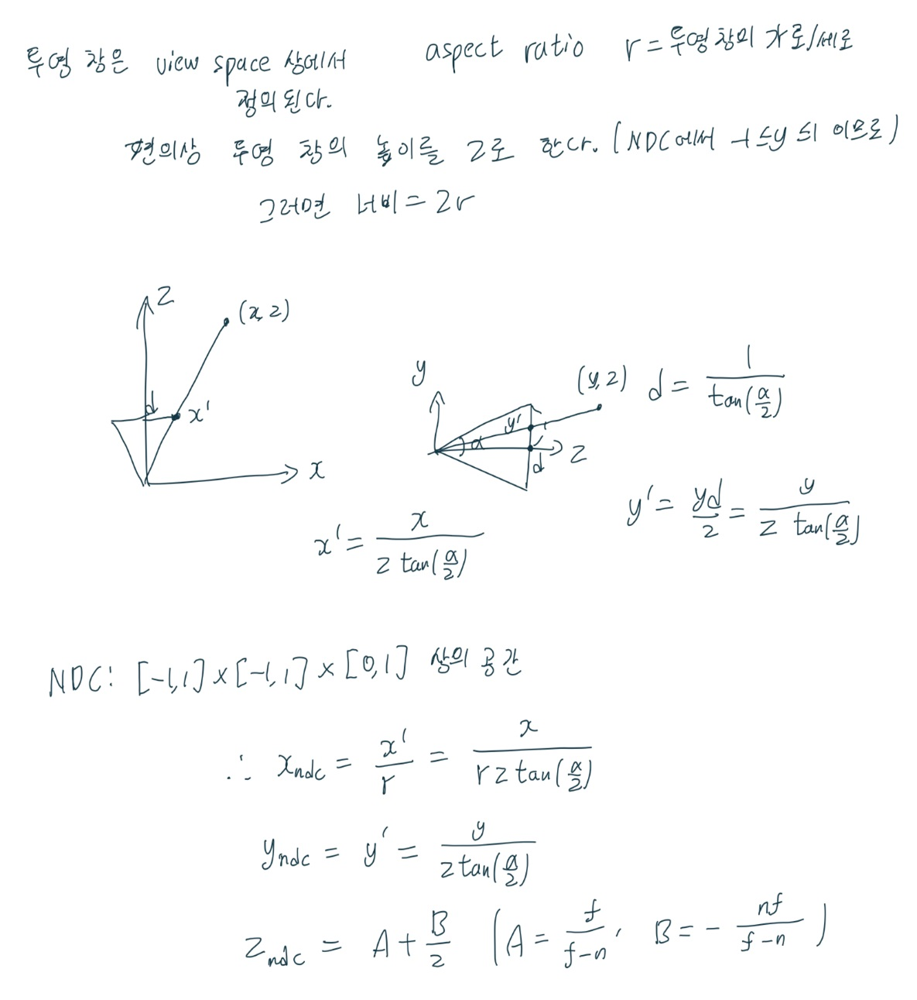
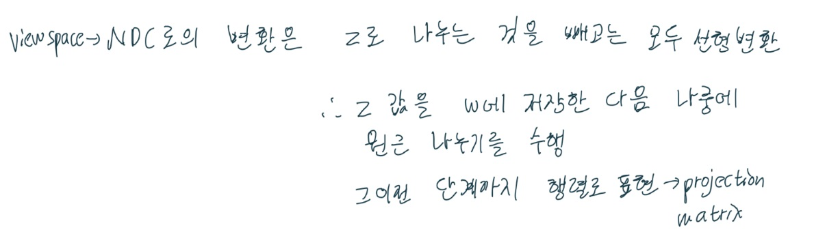
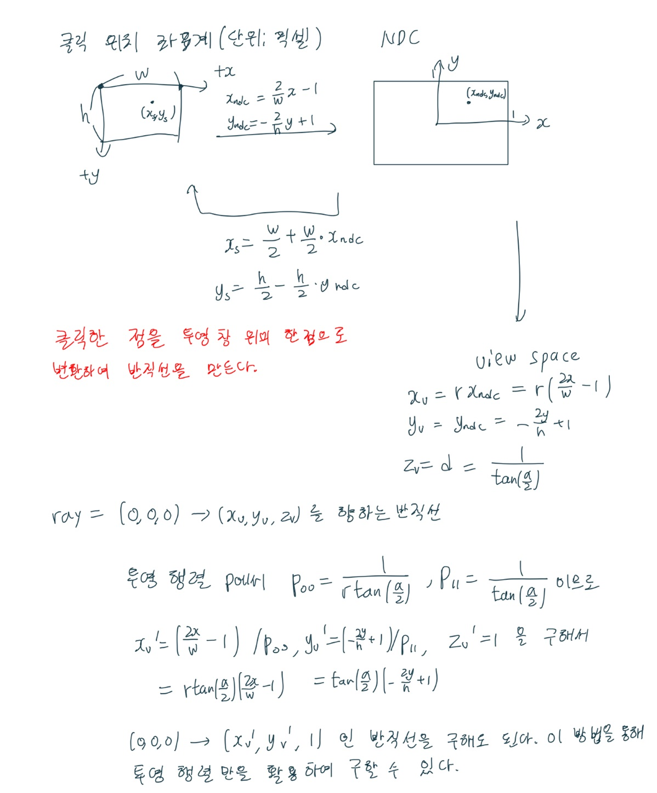
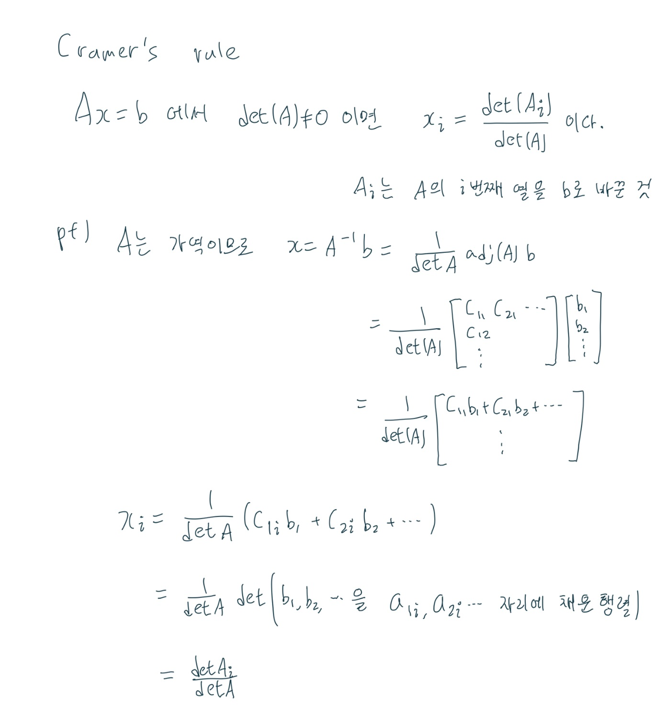

# Chap17 3차원 물체의 선택(Picking)

이번 장에서는 사용자가 마우스로 클릭한 3차원 물체가 무엇인지 파악하는 문제를 살펴본다. 이 문제를 해결하기 위해서는 2차원 정보인 마우스 커서의 위치를 3차원 공간으로 변환해야 한다. 마우스의 한 점은 3차원 공간에서 시작점이 카메라의 위치인 반직선에 대응된다. 당연히 반직선은 여러 개의 기본도형들과 만날 것이다. 사용자가 선택하는 것은 시작점으로부터 가장 가까운 기본도형 또는 물체이다. 교차하는 물체가 하나도 없으면 아무 물체도 선택되지 않는 것이다.

## 목표

1. 선택 알고리즘의 작동 방식과 구현 방법을 배운다.

## 17.1 화면에서 투영 창으로의 변환

Windows를 기준으로 화면을 클릭하는 좌표는 왼쪽 위를 0, 0으로 잡고 픽셀 단위로 측정한다.

## 17.3 반직선 대 메시 교차 판정

### 17.3.3 반직선 대 삼각형 교차 판정

삼각형의 세 점을 각각 $\mathrm{v}_0, \mathrm{v}_1, \mathrm{v}_2$라고 한다면 매개변수 방정식
$\mathrm{T}(u, v) = \mathrm{v}_0 + u(\mathrm{v}_1-\mathrm{v}_0) + v(\mathrm{v}_2-\mathrm{v}_0)$로 표현할 수 있다.
단, $u \geqq 0, v \geqq 0, u + v \leqq 1$을 만족한다.

반직선의 매개변수 방정식은 $\mathrm{r}(t) = \mathrm{q}+t\mathrm{u}$로 표현할 수 있다. 단, $t \geqq 0$을 만족해야 한다.

두 교점을 구하기 위해서는 $\mathrm{T}(u, v) = \mathrm{r}(t)$을 풀어야 한다.

이 방정식을 t, u, v에 대해 정리하면 다음과 같다.

$-t\mathrm{u}+u(\mathrm{v}_1-\mathrm{v}_0)+v(\mathrm{v}_2-\mathrm{v}_0) = \mathrm{q} + \mathrm{v}_0$

이 방정식은 Cramer's Rule을 사용하면 해결할 수 있으며, u, v, t가 필요한 조건들을 모두 만족한다면 교차하는 것으로 판정할 수 있다.

