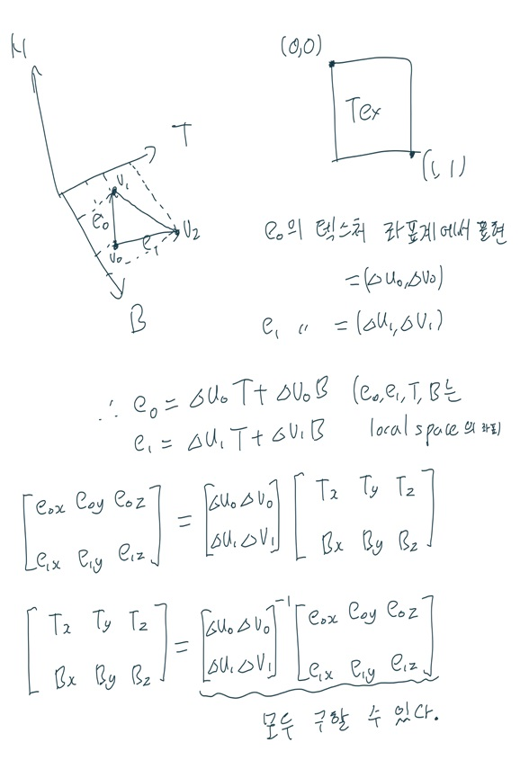

# Chap19 노멀 매핑

노멀 매핑은 표면 법선(Normal)을 더 세밀하게 지정할 수 있는 방법이다. 노멀 매핑을 적용하면 조명의 세부도를 높일 수 있다. 다만 메시 자체의 세부도는 높아지지 않는다. 연습문제에서는 이 문제의 해결책 중 하나인 변위 매핑(displacement mapping)을 연습한다.

## 목표

1. 노멀 매핑이 왜 필요한지 이해한다.
2. 노멀 맵 저장 방식을 파악한다.
3. 노멀 맵을 만드는 방법을 배운다.
4. 노멀 맵에서 법선 벡터들의 기준이 되는 좌표계를 살펴보고, 그 좌표계와 삼각형의 물체 공간 좌표계 사이의 관계를 이해한다.
5. 정점 셰이더와 픽셀 셰이더로 노멀 매핑을 구현하는 방법을 배운다.

## 19.1 동기

광원의 처리 결과는 메시의 기하구조를 따라가기 때문에 텍스처가 울퉁불퉁한 표면을 표현했을 경우 부자연스럽다. 가장 이상적인 것은 테셀레이션을 통해서 기하구조를 세분하는 것이지만, 분할된 각 정점들의 위치와 법선을 잘 지정해주어야 한다.

노멀 매핑은 법선을 텍스처의 형태로 저장하는 것이다. 노멀 매핑을 통해 좀 더 자세한 광원 묘사를 할 수 있다.

## 19.2 노멀 맵

노멀 맵은 각 텍셀에 RGB가 아닌 법선 벡터를 저장한다. 법선 벡터는 단위 벡터이므로 x, y, z 성분이 모두 [-1, 1] 구간에 속한다. 텍셀의 RGB 성분에 각각 8비트씩을 할당한다고 하면 (0.5x+0.5)\*255를 계산하면 법선 성분을 [0, 255]로 변환할 수 있다.

반대로 텍스처로부터 법선을 추출하는 방법은 Sample 메서드를 통해 추출한 표본에 2배를 한 다음 각 성분에서 1씩 빼주는 것이다. Sample 메서드의 결과의 각 성분은 [0, 1] 구간에 속하기 때문이다.

법선 벡터를 보다 정확하게 저장하고 싶다면 BC7의 형태로 저장하는 것이 좋다.

## 19.3 텍스처 공간 또는 접공간

텍스처를 삼각형에 입힐 때 텍스처 좌표계의 기저를 T, B라고 정의하자. 텍스처 좌표계는 왼쪽 위를 (0, 0), 오른쪽 아래를 (1, 1)로 정의한다. 여기에 법선 벡터 N을 추가하여 TBN 좌표계를 정의할 수 있다. 이 공간을 텍스처 공간 또는 접공간이라고 부른다.

삼각형의 세 꼭짓점의 텍스처 좌표와 local space 상의 좌표를 알고 있다면 다음과 같이 local space 상에서의 TBN 기저를 구할 수 있다.

벡터 T를 접벡터(tangent vector) 또는 접선 벡터라고 부르고, B를 종법선(binormal) 또는 종접선(bitangent) 벡터라고 부른다.

노말 맵에 저장되어 있는 법선 벡터의 자료는 접공간에서의 좌표를 말한다. 따라서 조명을 계산할 때에는 법선을 세계 공간에 대한 벡터로 변환해야 한다.

## 19.4 정점 접공간

삼각형 별로 TBN 공간을 적용하게 되면 삼각형의 경계면에서 갑자기 기저가 변하므로 조명이 삼각형 별로 분리된 모습이 된다. 따라서 한 정점의 법선을 그 정점이 포함된 삼각형들의 평균으로 사용했던 것처럼 T와 B 벡터에 대해서도 동일한 과정을 적용시킬 수 있다.

정점별로 TBN 기저들을 구한 다음 보간을 할 경우 TBN이 각각 직교하지 않을 수 있다. 따라서 그람-슈미트 등의 방법을 사용해서 TBN을 정규직교화해야 한다.

여기서는 T와 N을 전달받아 T를 N에 대해서 직교화한 다음, N×T를 계산하여 B를 구한다. GeometryGenerator 클래스의 경우 정점들을 반환할 때 N과 T를 같이 반환해준다.

## 19.5 접공간과 물체 공간(local space) 사이의 변환

이제 local space 상에서의 TBN 기저를 알아냈다. 그러면 접공간에서 local space로 변환할 때 곱해야 하는 행렬은 다음과 같다.

$M_{object}=\begin{bmatrix}T_x&T_y&T_z \\ B_x&B_y&B_z \\ N_x&N_y&N_z\end{bmatrix}$

이 행렬은 직교행렬임을 기억하자.

따라서 접공간 상에서 local space로 변환한 다음, world space로 변환하려면 world 행렬을 곱하면 된다.

$n_{world}=n_{tangent} M_{object} M_{world}$

만약 동일한 접공간의 여러 법선을 월드 좌표로 변환해야 한다면 M_object M_world를 먼저 계산하는 것이 효율적일 것이다. 이 행렬은 TBN을 world 공간에 대하여 표현한 것과 같다.

법선의 변환에는 정점이 관여하지 않기 때문에 4번째 행과 열은 필요하지 않다.

## 19.6 법선 매핑 셰이더 코드

Common.hlsl에 접공간의 법선을 세계 공간으로 변환하는 함수를 추가했다. 이 함수는 N과 T를 받아 변환을 진행하는데, 일단 T=normalize(tangent-dot(tangent, N)\*N)을 통해 N을 기준으로 T의 수직 성분만 남긴다. 그 다음 B=cross(N, T)를 통해 B를 구한다.
추가적으로 노멀 맵의 각 텍셀의 알파 채널에는 광택도(shininess)계수가 들어있다. 이 성분을 광택도 계산에 반영하여 세부적인 광택 계수를 조정할 수 있다.
