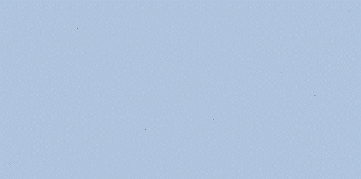
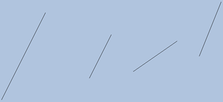
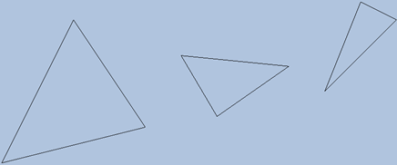

1. 어렵지 않은 문제이므로 패스.
2. 정점 입력 슬롯을 2개로 분할하기 위해서는 정점 버퍼를 총 2개를 만들어야 한다. 이를 위해서 구조체를 2개로 분할하며, D3D12_INPUT_ELEMENT_DESC의 요소들 중 입력 슬롯과 바이트 오프셋을 변경한다.
   이후에는 CreateDefaultBuffer를 이용하여 총 2개의 정점 버퍼를 생성해주고, 마찬가지로 정점 버퍼 서술자가 2개 들어있는 배열을 작성하여 IASetVertexBuffers 호출 시 2개의 서술자를 전달하면 된다. 인덱스 버퍼는 기존과 비슷하게 진행해도 되며, 문제를 해결할 때는 서술자도 새로 작성했다.

3. (a), (b), (c), (d): 정점 목록은 다음과 같이 작성하였다.

```C++
std::array<Vertex, 8> vertices = {
    Vertex({ XMFLOAT3(-5.0f, 0.0f, -2.0f), XMFLOAT4(Colors::Black) }),
    Vertex({ XMFLOAT3(-3.0f, 0.0f, +2.0f), XMFLOAT4(Colors::Black) }),
    Vertex({ XMFLOAT3(-1.0f, 0.0f, -1.0f), XMFLOAT4(Colors::Black) }),
    Vertex({ XMFLOAT3(-0.0f, 0.0f, +1.0f), XMFLOAT4(Colors::Black) }),
    Vertex({ XMFLOAT3(+1.0f, 0.0f, -0.7f), XMFLOAT4(Colors::Black) }),
    Vertex({ XMFLOAT3(+3.0f, 0.0f, +0.7f), XMFLOAT4(Colors::Black) }),
    Vertex({ XMFLOAT3(+4.0f, 0.0f, +0.0f), XMFLOAT4(Colors::Black) }),
    Vertex({ XMFLOAT3(+5.0f, 0.0f, +2.5f), XMFLOAT4(Colors::Black) }),
}
```

이후 IASetPrimitiveTopology를 변경해가면서 그리면 결과는 다음과 같다.

(a): POINTLIST 하나의 픽셀로 정점이 찍히기 때문에 자세하게 보아야 한다.



(b): LINESTRIP


(c): LINELIST



(d): TRIANGLESTRIP


(e): TRIANGLELIST를 구현하기 위해 정점을 하나 추가, WIREFRAME 모드와 backface culling 비활성.



5. 정점들을 이어 삼각형을 만드는 경우 자동적으로 비선형 보간이 일어나 각 픽셀들이 보간된 색으로 맞춰진다.
6. 정점 데이터를 그대로 둔 상태에서 각각의 물체에 월드 행렬(즉, 각 물체에 대한 상수 버퍼를적용시키는 방법)을 적용시키는 방법을 모르겠다. 이후 7장에서 배우는 듯하다. 지금은 각 정점의 좌표를 변경하는 것이 최선.
7. XMCOLOR는 32비트이고 HLSL에서 float4는 총 32바이트이므로 서로 호환이 되는지 궁금했는데, 암묵적으로 형 변환이 일어나 정상적으로 작동한다.
8. (a)와 (b) 모두 순서를 바꿔도 상관없다. 어차피 HLSL 상에서의 변수와 입력 배치 서술 사이에는 SemanticName을 기준으로 매칭되기 때문.
9. Command List의 RSSetScissorRects를 호출할 때 전달하는 직사각형의 의미는 {좌, 상, 우, 하} 각각의 좌표를 의미한다. 즉, 이 문제에서 가운데의 가로/2, 세로/2 크기의 직사각형을 지정하고 싶으면 w/4, h/4, w\*3/4, h\*3/4를 지정해야 하는 것이다.
10. smooth easing function으로 그냥 사인 함수를 적용했다.
11. HLSL의 clip이 하는 기능은 해당 값이 0보다 작은 경우 픽셀을 폐기하는 것이다.
